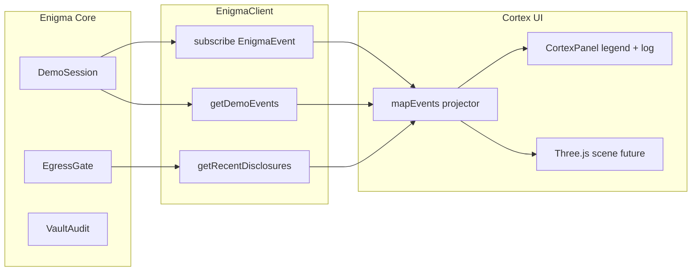

# Cortex visualizer

**Purpose:** Live debug and privacy observability for Enigma — visualise what the system **did** (state transitions, data movement), **not** LLM chain-of-thought or hidden reasoning traces.

**Philosophy:** [north-star.md](./north-star.md) (squeeze 5 — privacy as observable behaviour, not a wallpaper lock emoji)

**Anthropomorphism:** Cortex shows **system events**, not private thoughts, emotions, or consciousness ([ethics.md](./ethics.md) · [ADR-026](../adr/026-ethics-creed-user-is-subject.md)). Do not product-copy Cortex as a mind that feels, wants, or thinks about the user.

**Preferred name:** **Cortex** (not “Neural View” or “Brain View” in product copy).

**Ticket:** [C10](../../tickets/conversational-ui/C10-cortex-brain-visualizer.md)

**Status:** **DEFERRED** until SEC-04 stabilises source→vault→transform→egress event flow. Scaffold landed (types, projection, placeholder panel); **not wired to HomePage**.

Conversation-thread activity (NORMAL / CURIOUS labels such as “Checked your calendar”) is **[C14](../../tickets/conversational-ui/C14-conversation-activity-stream.md)** — same underlying hops, different projection. Cortex stays forensic / 3D. Do not duplicate a cognition log.

## Observability stack (now)

```text
Enigma Core → SEC-02/03 audit events → Egress Disclosure Panel (active)
```

Cortex wakes after SEC-04 gives stable ingestion lifecycle events.

## Frozen rule (C10)

> **Cortex may observe Enigma, but Cortex must never become a way of operating Enigma.**

Instrument panel, not control plane. No clicking nodes to mutate world model, approve assist, or alter attention.

## Read-only invariant

```
Audit / state / events  ──read──►  Cortex (UI)
World model / vault     ◄──write──  Enigma Core only
```

The Cortex module **never** writes world model, vault, attention policy, or retention state. It may fetch read-only projections (`/demo/events`, `/private/disclosure/recent`, future audit tail). No mutation endpoints from Cortex code paths.

## What it is not

| Shows | Does not show |
| --- | --- |
| Checkpoint jumps, attention qualification, egress disclosures | Token-level LLM “thinking” |
| Source ingest pulses (future Private) | Chat transcript as source of truth |
| Memory decay / forget operations (SEC-06) | Raw mail bodies or Notes text |

Cross-reference: [ADR-020](../adr/020-llm-conversational-boundary-not-truth.md) — conversational boundary is not truth; Cortex observes Core, not the remote model’s internal state.

## Stable region layout

Regions are fixed anchors in the 3D scene (future) and in the v0 legend (now):

```text
                    ┌── UPPER: attention, urgency, opportunity ──┐
                    │                                              │
     LEFT / INPUT   │           CENTRE: identity, entities,       │   RIGHT: support,
     sources        │           world model, relationships,        │   next actions, assists
     email · cal ·  │           commitments                        │
     messages       │                                              │
                    └────────────────── MEMBRANE (LOWER) ──────────┘
                         privacy transform · egress · audit
```

| Region ID | Contents | Typical events |
| --- | --- | --- |
| `input` | Email, calendar, messages ingress | `source_ingested` |
| `centre` | Identity, entities, world model, relationships, commitments | `world_state_changed`, `relation_added` |
| `upper` | Attention, urgency, opportunity | `attention_qualified` |
| `right` | Support layer, next actions, assists | `next_action_created` |
| `membrane` | Privacy transform, egress gate, audit log | `privacy_transform`, `egress` |
| `shadow` | Abstract retained state (post-transform) | `memory_decayed`, `memory_forgotten` |

## BrainEvent schema

Client types live in `apps/web/src/enigma/cortex/events.ts`. All events share:

```typescript
type BrainEventBase = {
  id: string;           // stable for list keys
  at: string;           // ISO timestamp
  region: BrainRegion;
  checkpoint_id?: string | null;
};
```

### Event kinds — v0 (demo projection, active)

| Type | Region | Meaning |
| --- | --- | --- |
| `world_state_changed` | `centre` | Checkpoint, entity graph, or commitment set changed |
| `relation_added` | `centre` | New inferred or explicit relationship edge |
| `attention_qualified` | `upper` | Policy evaluated surface / context / suppress |
| `next_action_created` | `right` | Next-action layer emitted a candidate |
| `privacy_transform` | `membrane` | Payload transformed or blocked before egress |
| `egress` | `membrane` | Audited remote inference disclosure (sent) |
| `memory_decayed` | `shadow` | Retention pipeline reduced fidelity (SEC-06) |
| `memory_forgotten` | `shadow` | Explicit forget removed reconstructable material |

### Future BrainEvent vocabulary (post-SEC-04)

`source_ingested` · `mime_parsed` · `private_record_created` · `world_state_changed` · `relation_changed` · `privacy_transform` · `egress_allowed` · `egress_denied` · `memory_decayed` · `memory_forgotten`

Events are **projected** from existing feeds today; a dedicated audit stream arrives with SEC-04 ingestion lifecycle plumbing.

## Event flow (v0)



Projection rules (v0): see `apps/web/src/enigma/cortex/mapEvents.ts`.

- Demo evaluation log kinds (`checkpoint_jump`, `attention_surfaced`, `proactive_silence`, …) → `world_state_changed` / `attention_qualified`
- `EnigmaEvent.attention_changed` → `world_state_changed`
- `EgressDisclosure` blocked → `privacy_transform`; sent → `egress`

Future (post-SEC-04): ingest lifecycle emits `source_ingested`, `mime_parsed`, `private_record_created`; egress gate emits `egress_allowed` / `egress_denied`; SEC-06 emits `memory_decayed` / `memory_forgotten`.

## Privacy mode — “What left the brain”

User gesture: click **membrane** region (or toggle in v0 panel).

1. Highlight recent `egress` and `privacy_transform` events
2. Animate collapse: rich centre geometry → coarse shadow abstraction
3. Side panel lists [egress disclosures](./conversational-ui.md) (same feed as [EgressDisclosurePanel](../../apps/web/src/enigma/EgressDisclosurePanel.tsx)) — structured field summaries only

Ties to [ADR-023](../adr/023-persistent-shadow-abstract-state-not-biography.md): shadow is abstract state, not biography.

### Shadow decay visual

Three-stage fade in the scene (future animation):

```text
RAW (rich mesh)  →  SHADOW (abstract geometry)  →  FORGET (fade out)
```

Maps to retention zones in [data-retention.md](./data-retention.md).

## SEC-07 retention slider

Interactive control for the [Shadow Reconstruction benchmark](../../tickets/security/SEC-07-shadow-reconstruction-benchmark.md) dual metrics:

```text
SOURCE ──► ACTIVE ──► SHADOW ──► FORGOTTEN
         utility % ↑        reconstructability % ↓
```

| Stop | Retention zone | Utility (executive function) | Reconstructability (biography) |
| --- | --- | --- | --- |
| SOURCE | Raw identifiable | Highest | Highest (FAIL for pilot) |
| ACTIVE | Working memory | High | Medium |
| SHADOW | Pseudonymous abstract | Target: high | Target: ~0 |
| FORGOTTEN | Expunged | Lower | 0 |

v0: slider is a **stub** with fixture percentages. Live binding requires SEC-07 benchmark report artifact.

**PASS curve:** utility stays high while reconstructability collapses to zero — biography destroyed before executive function.

## Stack

| Layer | Choice | Notes |
| --- | --- | --- |
| UI shell | React (existing Enigma home) | Toggle panel like egress disclosure |
| 3D scene | **react-three-fiber** (Three.js) | Future; not in v0 bundle |
| Data | Client-side projection | No new runtime Python dependency |
| Tests | Vitest + Testing Library | Projection units + panel smoke |

Do not add `@react-three/fiber` until the scene ticket is actively claimed — keeps web bundle lean for v0.

## Related

- [conversational-ui.md](./conversational-ui.md) — EnigmaClient boundary, Demo instrumentation
- [conversational-stream.md](./conversational-stream.md) — in-thread activity (NORMAL/CURIOUS); Cortex is FORENSIC
- [personal-data-security.md](./personal-data-security.md) — egress gate, threat model
- [data-retention.md](./data-retention.md) — retention zones, red-line reconstructability test
- [SEC-02](../../tickets/security/SEC-02-audited-remote-egress-gate.md) — disclosure ledger
- [ADR-029](../adr/029-context-compilation-request-shaped-memory.md) — compiled-turn manifest on membrane / disclosure
- [SEC-07](../../tickets/security/SEC-07-shadow-reconstruction-benchmark.md) — dual-metric benchmark
- [ethics.md](./ethics.md) · [ADR-026](../adr/026-ethics-creed-user-is-subject.md) — Cortex is events, not a mind
