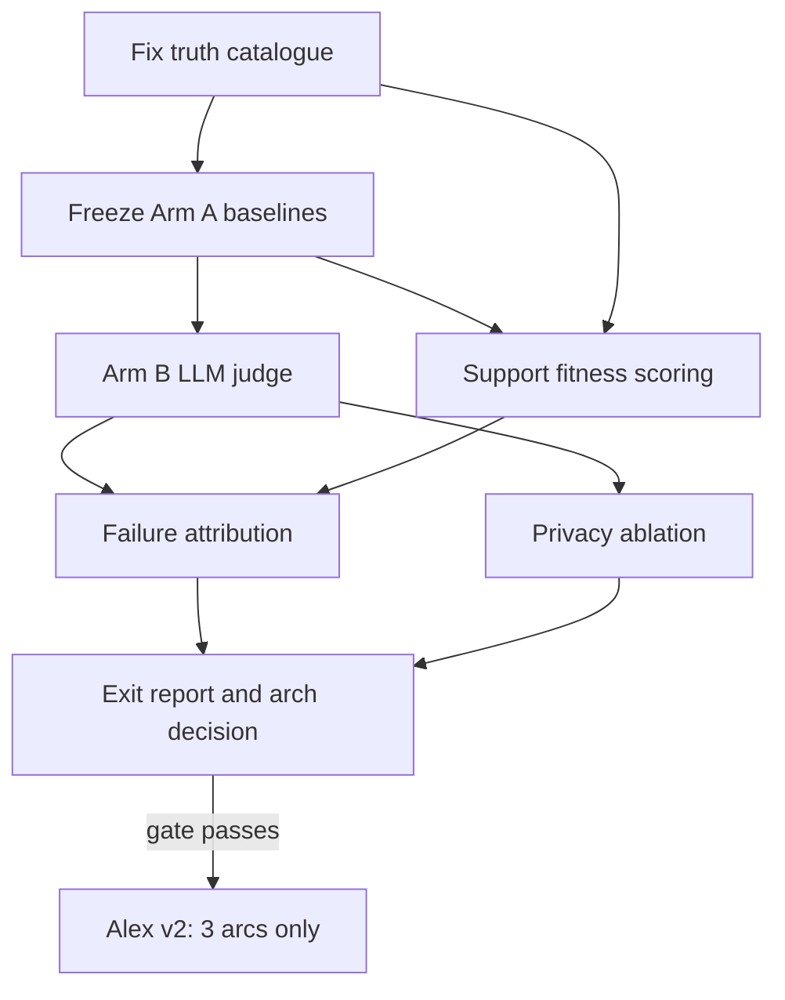
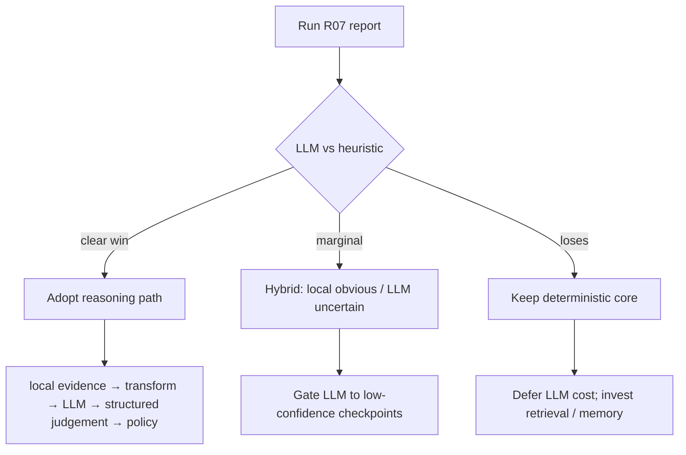

# Reasoning Value Gate — sprint charter

**Status:** Active sprint (post Phase 2.5 design)  
**Governing ADR:** [012-reasoning-value-gate-decision.md](../adr/012-reasoning-value-gate-decision.md) (evidence filled by R07)  
**Tickets:** [R01–R07](../../tickets/reasoning/)

## Goal

Kill the highest-leverage uncertainty before more machinery:

> **Should a reasoning model become part of Enigma's brain?**

Prove whether a strong reasoning LLM can make **materially better** attention and next-action decisions than the current deterministic system — using **identical evidence** and a **trustworthy ground-truth benchmark**.

Sprint output is primarily a **confident A/B report** and an architecture decision — not product features.

---

## Why now

| Asset | Gap |
| --- | --- |
| alex-v1 timeline | Story complete; evaluator truth incomplete (brunch, expenses, dentist missing from obligations) |
| alex-v1-support-challenge-catalogue | Docs-only — not machine-scorable |
| HeuristicAttentionEngine | Arm A baseline exists |
| PaygReasoningService + D11 replay | Ready — no benchmark harness |
| V2-EF-01 / EF-01 / D14 | Superseded by R01–R04 (consolidated sprint) |

---

## Ticket ladder

Claim in order ([tickets/README.md](../../tickets/README.md)):

| # | Ticket | Branch | Absorbs |
| --- | --- | --- | --- |
| R01 | [Scenario truth catalogue](../../tickets/reasoning/R01-scenario-truth-catalogue.md) | `ticket/R01-scenario-truth-catalogue` | V2-EF-01 |
| R02 | [Freeze Arm A](../../tickets/reasoning/R02-freeze-arm-a.md) | `ticket/R02-freeze-arm-a` | — |
| R03 | [LLM judge](../../tickets/reasoning/R03-llm-judge.md) | `ticket/R03-llm-judge` | D14 |
| R04 | [Support fitness scoring](../../tickets/reasoning/R04-support-fitness.md) | `ticket/R04-support-fitness` | EF-01 |
| R05 | [Failure attribution](../../tickets/reasoning/R05-failure-attribution.md) | `ticket/R05-failure-attribution` | — |
| R06 | [Privacy ablation](../../tickets/reasoning/R06-privacy-ablation.md) | `ticket/R06-privacy-ablation` | — |
| R07 | [Exit report + decision](../../tickets/reasoning/R07-reasoning-value-gate-report.md) | `ticket/R07-reasoning-value-gate-report` | — |

### Parallelism

| Phase | Safe parallel? |
| --- | --- |
| R01 | Single agent (schema + truth) |
| R02 | After R01 |
| R03 ∥ R04 | After R02 (R04 can start during R03 if R01 done) |
| R05 | After R03 + R04 |
| R06 | After R03 (may overlap late R05) |
| R07 | After R05 + R06 |

---

## Exit gate table

Sprint completes when [R07](../../tickets/reasoning/R07-reasoning-value-gate-report.md) produces measured values (not placeholders):

| Metric | Arm A (heuristic) | Arm B (LLM) | Pass signal |
| --- | --- | --- | --- |
| Critical recall | measured | measured | Truthful alex-v1 arcs scored |
| Must-suppress accuracy | measured | measured | Newsletters / PrizeVault / machine mail quiet |
| Top-3 critical recall | measured | measured | Brunch-type regressions visible |
| Next-action fit | measured | measured | Support contracts drive scoring |
| Timing accuracy | measured | measured | Window hits vs early/late |
| Median latency | ~ms | ~s | Documented per checkpoint |
| Cost/month extrapolation | ~$0 | measured | Token log → monthly estimate |
| Privacy ablation delta | — | raw vs transformed | Quantified transform cost |
| Failure attribution | per disagreement | per disagreement | Every A/B miss classified |

---

## Architecture decision tree

Evidence fills [ADR-012](../adr/012-reasoning-value-gate-decision.md). Outcome drives next investment:

| Outcome | Architecture path |
| --- | --- |
| **LLM clearly wins** | Adopt: local evidence → privacy transform → reasoning LLM → structured judgement → deterministic policy |
| **Barely wins** | Hybrid: obvious → local; uncertain → LLM |
| **Loses** | Keep deterministic; save cost, latency, privacy exposure |

---

## Stretch (after R07 passes)

Amend [V2-EF-02](../../tickets/demo-scenario/V2-EF-02-ef-arc-authoring.md) → **3 longitudinal arcs only** (3–6 months each):

1. Boring recurring admin (expenses drift)
2. Long-running work project (Atlas-style)
3. Relationship/social commitment (parents multi-visit)

Proves longitudinal machinery for the next question: *Does accumulated memory improve reasoning over 6–12 months?*

---

## Non-goals (sprint boundary)

- Tauri / desktop shell
- Shadow Mode features beyond existing scaffold
- 40k email corpus generation
- Changing `HeuristicAttentionEngine` ranking logic during the gate (observe, don't fix)
- Runtime Next Action product surface ([N01](../../tickets/next-action/N01-scorer-stub.md) waits)
- Full alex-v2 12-month / ~30-arc authoring

---

## Related docs

- [Executive-function support benchmark](../architecture/executive-function-support-benchmark.md) — support fitness rubric
- [ADR-011](../adr/011-observable-support-challenges-only.md) — evaluator-only challenges
- [milestone-map.md](../architecture/milestone-map.md) — R01→R07 claim order
- [phase-2-exit-gate.md](./phase-2-exit-gate.md) — prior Demo Mode gate (complete)
